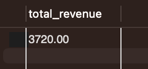

# sql-sales-performance-analysis
Business-oriented sales analysis using SQL

## 📊 Résultats & interprétation

### 💰 Chiffre d’affaires
Le chiffre d’affaires total reflète la performance globale de l’entreprise sur la période étudiée.
Les ventes sont principalement portées par la catégorie *Electronics*, ce qui indique une forte dépendance
à certains produits à forte valeur.

### 📈 Évolution mensuelle
L’analyse mensuelle montre une progression des ventes, suggérant une croissance progressive de l’activité.
Ces informations peuvent aider à mieux anticiper les périodes de forte et faible demande.

### 🏆 Clients à forte valeur
Une part importante du chiffre d’affaires est générée par un nombre restreint de clients.
Cela met en évidence l’importance de stratégies de fidélisation ciblées.

### 📦 Performance produits
Les produits électroniques dominent à la fois en volume et en chiffre d’affaires.
Un ajustement de l’offre ou une diversification pourrait améliorer la performance globale.

### 🔁 Fidélisation
Le taux de réachat montre l’existence de clients récurrents, mais laisse entrevoir
un potentiel d’amélioration via des actions marketing dédiées.

### 📊 Aperçu des résultats

## 💡 Recommandations

- Renforcer la fidélisation des clients à forte valeur
- Optimiser le catalogue produits en priorisant les catégories les plus rentables
- Développer des actions marketing ciblées sur les périodes performantes
- Exploiter les données clients pour améliorer la rétention

